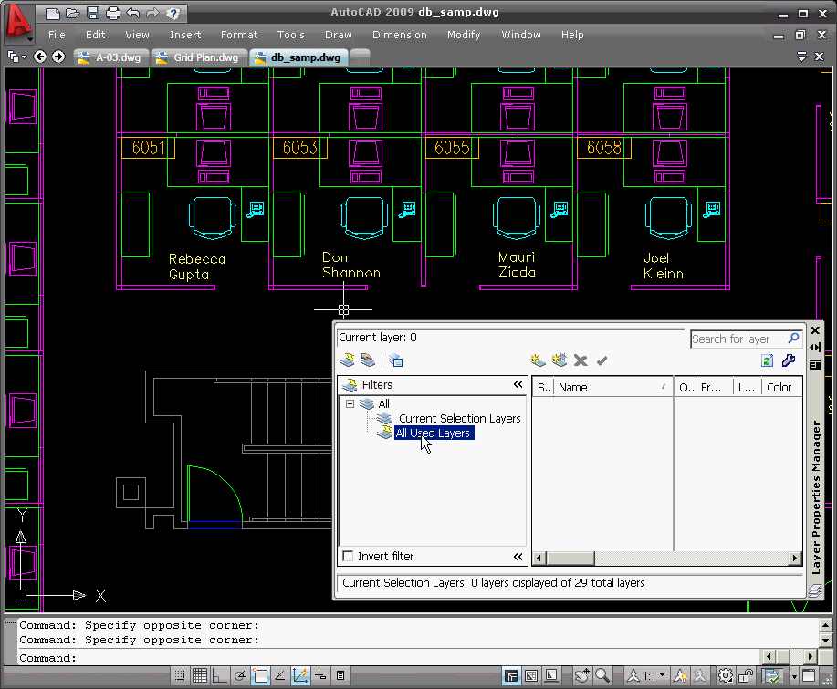

## SelectionLayerFilter

Tony Tanzillo/ActivistInvestor
Released under the MIT License

### Background:

SelectionLayerFilter is a mixed-mode managed/native ObjectARX extension that implements custom layer filters for various purposes, the main one being the ability to constrain the list of visible layers in the modal and modeless layer manager UIs to only those layers that are referenced by the current/pickfirst selection. The extension also works with the classic layer command (modal layer UI), using the included QLAYER command.

This project was developed back in the AutoCAD 2008 timeframe, and targeted AutoCAD 2009 and 2010. It was never released as a public extension or product, but is being released now as a sample for educational purposes, and for those who wish to pursue its modernization and integration into current AutoCAD product releases. The project has not been modernized or upgraded to current Visual Studio/AutoCAD versions, and is provided as-is. It is assumed that anyone wishing to use this extension will need to upgrade and modernize it for their own purposes.

<center></center><br>

## Custom Layer Filters:

1. The **Current Selection Layers** filter is a specialization of AcLyLayerFilter that constrains the list of visible layers to only those referenced by entitites in the current/pickfirst selection.  It is not saved with the drawing.

2. The **Nested Selection Layers** filter constrains the visibile layers to only those referenced by nested entities in the current/pickfirst selection. This filter is a child of the Current Selection Layers filter. It is not saved with the drawing.

3. The **Recently Used Layers** filter constraints the list of visible layers to only Layers that were recently created, current, or have been assigned to the layer property of one or more entities. The user can configure the number of layers to include in this filter. It is not saved with the drawing.

## The QLAYER command

The QLAYER (or 'Quick Layer') command is a custom command that is implemented by this extension. It prompts the user to select one or more entities (or uses the currently-selected entities), and then displays the modal (CLASSICLAYER) dialog with the Current Selection Layers filter active.

QLAYER is registered with ACRX_CMD_USEPICKSET.
    
## Complications encountered in the development of this extension

In order for the Current Selection Layers filter to work with the modeless layer palette, the layer list must be invalidated and updated whenever the current/pickfirst selection changes. A notification was added to the ```LayerFilterManager::pickfirstModified()``` method, which is called whenever the selection changes. That method in-turn calls the ```LayerFilterDocData::OnPickfirstModified()``` method, which invalidates the layer list and forces it to update. That is achieved by simply assigning the CLAYER system variable to its current value, which the floating layer palette UI watches, causing it to update the UI and layer list.